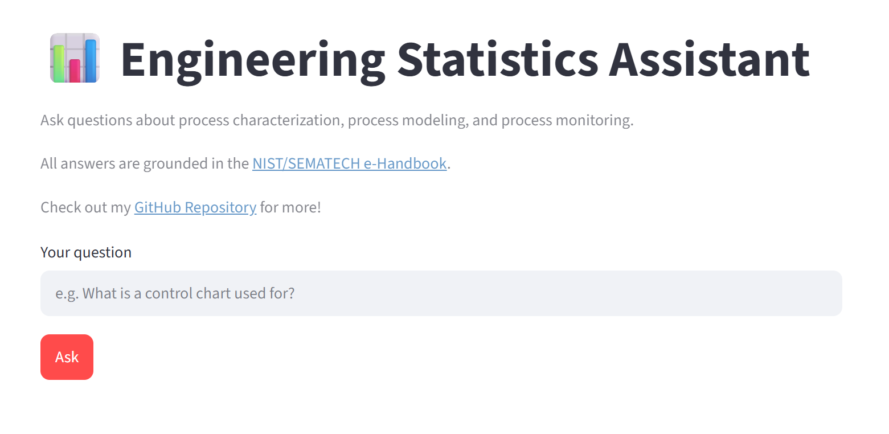
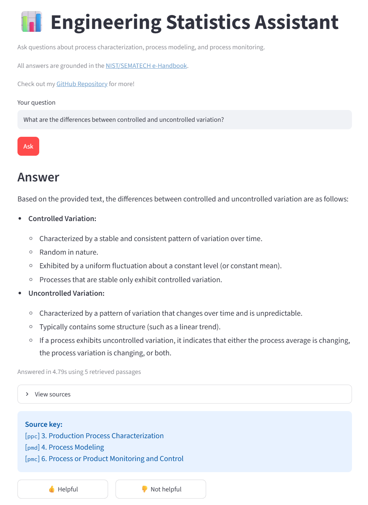
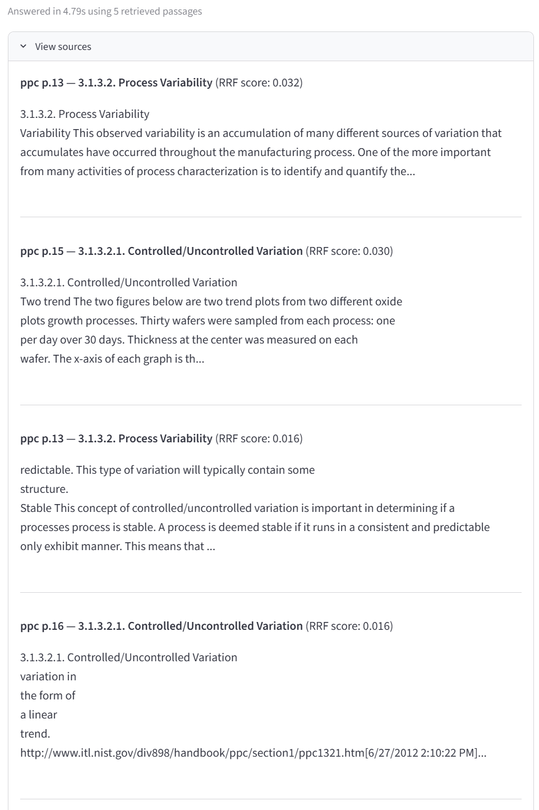
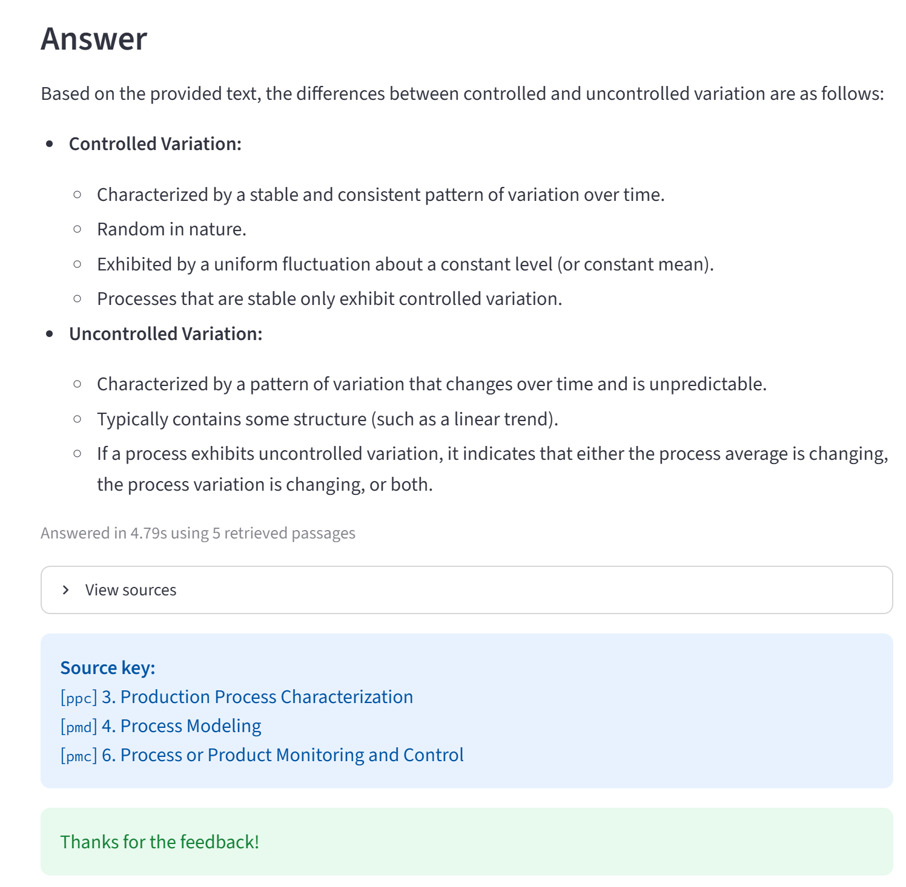
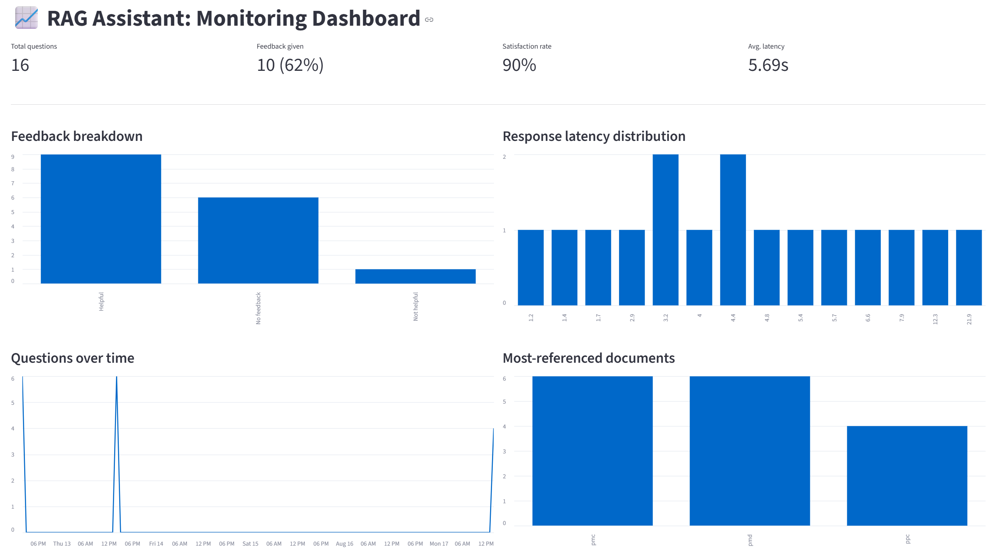
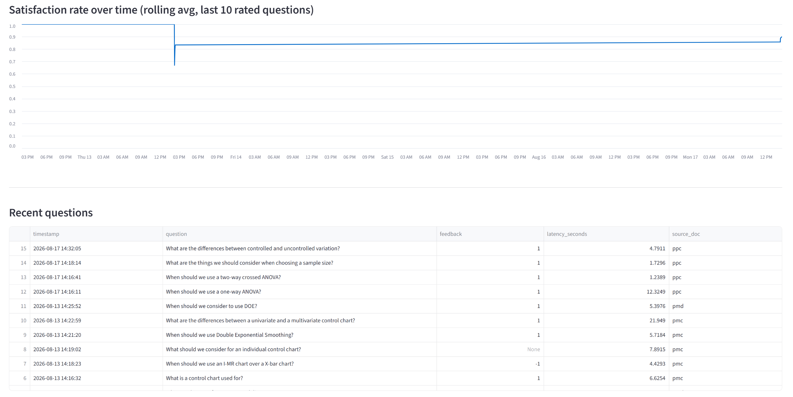

# Engineering Statistics Handbook Assistant

A RAG (Retrieval-Augmented Generation) application that answers questions about
semiconductor manufacturing statistics: process monitoring and control, process characterization, and
process modeling. The data is based on the NIST/SEMATECH e-Handbook of Statistical
Methods. Built as the capstone project for [LLM Zoomcamp](https://github.com/DataTalksClub/llm-zoomcamp).

📊 **Live app demo:** [Demo Link](https://llm-capstone-project-app-kangmx.streamlit.app/) \
📈 **Dashboard demo:** [Demo Link](https://llm-capstone-project-dashboard-kangmx.streamlit.app/) \
📦 **Repo:** [Repo Link](https://github.com/kang-mx/llm-zoomcamp/tree/main/capstone-project)
---

## Problem Description

Engineers and students working with statistical process control, process
characterization, and process modeling often need quick, grounded answers
without manually searching a 2,600-page reference document. This project
solves that by retrieving the most relevant passages from the NIST/SEMATECH
Engineering Statistics Handbook and generating a grounded, cited answer via
an LLM — with both retrieval quality and answer quality empirically evaluated
rather than assumed.

## Dataset

Three chapters of the public-domain [NIST/SEMATECH e-Handbook of Statistical
Methods](https://www.itl.nist.gov/div898/handbook/), a joint NIST–SEMATECH
publication written specifically to bring statistical methods to semiconductor
manufacturing engineers:

| File | Chapter |
|---|---|
| `data/ppc.pdf` | 3. Production Process Characterization |
| `data/pmd.pdf` | 4. Process Modeling |
| `data/pmc.pdf` | 6. Process or Product Monitoring and Control |

The dataset is public domain (U.S. government work) and committed directly
to this repo — no external download needed to reproduce this project.

## Evaluation Criteria Mapping

| Criterion | Where it's addressed |
|---|---|
| Problem description | This section |
| Retrieval flow | [Architecture](#architecture) |
| Retrieval evaluation | [Retrieval Evaluation Results](#retrieval-evaluation-results) |
| LLM evaluation | [LLM Evaluation Results](#llm-evaluation-results) |
| Interface | [Interface](#interface) |
| Ingestion pipeline | [Ingestion Pipeline](#ingestion-pipeline) |
| Monitoring | [Monitoring](#monitoring) |
| Containerization | [Running the Project](#running-the-project) |
| Reproducibility | [Running the Project](#running-the-project) |
| Best practices: hybrid search | [Retrieval Evaluation Results](#retrieval-evaluation-results) |
| Best practices: query rewriting | [LLM Evaluation Results](#llm-evaluation-results) |
| Bonus: cloud deployment | [Live Demo](#-live-app-demo-demo-link--dashboard-demo-demo-link--repo-repo-link) |

## Architecture

```
PDFs (data/) 
  → ingest.py             [dlt pipeline: parse + chunk → DuckDB]
  → embed_index.py        [sentence-transformers embeddings → FAISS index]
  → rag.py                [hybrid retrieval (FAISS + BM25 via RRF) → Gemini for generation]
  → streamlit_app.py      [user-facing interface + feedback logging]
  → dashboard.py          [monitoring dashboard, reads feedback.db]
```

**Tech stack:**
- **Ingestion:** [dlt](https://dlthub.com/) → DuckDB, section-aware chunking of the handbook PDFs
- **Embeddings:** local `sentence-transformers` (`all-MiniLM-L6-v2`) — chosen over the Gemini embeddings API after hitting free-tier rate limits mid-project; this also means retrieval works with zero API cost/latency
- **Vector search:** FAISS (in-memory, cosine similarity)
- **Keyword search:** BM25 (`rank_bm25`)
- **Hybrid retrieval:** Reciprocal Rank Fusion (RRF) combining FAISS + BM25 rankings
- **Generation:** Gemini API (`gemini-3.5-flash-lite`) via the OpenAI-compatible endpoint
- **Interface & monitoring:** Streamlit, with feedback logged to SQLite

## Ingestion Pipeline

`ingest.py` parses each PDF, splits text on the handbook's numbered section
headers (e.g. `6.3.1.1`) for semantically coherent chunks, falls back to
character-based chunking with overlap where headers aren't cleanly detected,
and filters out table-of-contents pages and near-empty fragments. The
pipeline is wrapped in `dlt` and loads into a local DuckDB table for
automated, re-runnable ingestion — **695 chunks** from the 3 source chapters.

```bash
python ingest.py
```

## Retrieval Evaluation Results

A ground-truth set of 304 questions was generated by prompting the LLM to
produce questions each chunk directly answers (`generate_ground_truth.py`),
then three retrieval strategies were evaluated against it (`eval_retrieval.py`):

| Method | Hit Rate | MRR |
|---|---|---|
| Vector search (FAISS) | 0.8717 | 0.6976 |
| Keyword search (BM25) | 0.8651 | 0.7615 |
| **Hybrid search (RRF)** | **0.9145** | **0.7718** |

Hybrid search (combining FAISS and BM25 via Reciprocal Rank Fusion) clearly
outperformed either individual method on both hit rate and MRR, and is used
as the default retrieval strategy in the app.

## LLM Evaluation Results

Two approaches to the final answer generation step were compared using an
LLM-as-judge (`evaluate_llm_output.py`) on faithfulness, relevance, and
clarity, across a sample of 10 questions:

| Approach | Avg. Score |
|---|---|
| **No query rewriting** | **4.90** |
| With query rewriting | 4.73 |

Query rewriting was implemented and evaluated but did **not** improve answer
quality for this domain — the handbook's technical questions are already
precise, and rewriting occasionally introduced drift rather than clarity.
The app uses the simpler, better-performing no-rewriting approach by default.

## Interface

Built with Streamlit (`streamlit_app.py`): a question box, a grounded answer,
an expandable sources panel showing retrieved passages and their source
locations, and 👍/👎 feedback buttons on every answer.

_[screenshot: default app]_


_[screenshot: after asking a question]_


_[screenshot: sources panel expanded]_


_[screenshot: after giving feedback]_



## Monitoring

Every question, answer, latency, and feedback vote is logged to `feedback.db`
(SQLite). `dashboard.py` reads this data and shows:

- Total questions, feedback rate, satisfaction rate, avg. latency (summary metrics)
- Feedback breakdown (helpful / not helpful / no feedback)
- Response latency distribution
- Questions over time
- Most-referenced source documents
- Rolling satisfaction rate trend

_[screenshot: monitoring dashboard]_
 


## Running the Project

**Requirements:** Docker and Docker Compose.

1. Clone the repo:
    ```bash
   git clone https://github.com/kang-mx/llm-zoomcamp.git 
   cd capstone-project
   ```

2. Create a `.env` file in the project root:
    ```bash
    GEMINI_API_KEY=your-key-here
    ```
3. Build and run both services:
    ```bash 
    docker compose up --build
    ```
4. Open the app: [http://localhost:8501](http://localhost:8501)
   Open the dashboard: [http://localhost:8502](http://localhost:8502)

The FAISS index and embeddings are pre-built and committed to the repo, so
no ingestion or embedding step is required to run the app — those scripts
(`ingest.py`, `embed_index.py`) are provided for reproducing the pipeline
from scratch if desired.

### Running without Docker (manual setup)

```bash
pip install -r requirements.txt
python ingest.py          # only needed to rebuild from source PDFs
python embed_index.py     # only needed to rebuild the FAISS index
streamlit run streamlit_app.py    # in one terminal
streamlit run dashboard.py        # in a second terminal
```

## Repo Structure

```
.
├── data/
│   ├── ppc.pdf
│   ├── pmd.pdf
│   └── pmc.pdf
├── ingest.py                  # PDF parsing + chunking + dlt ingestion
├── embed_index.py              # local embeddings + FAISS index build
├── rag.py                      # retrieval (vector/BM25/hybrid) + generation
├── generate_ground_truth.py    # LLM-generated retrieval eval questions
├── eval_retrieval.py           # retrieval evaluation (hit rate / MRR)
├── evaluate_llm_output.py      # LLM-as-judge evaluation, with vs without rewriting
├── streamlit_app.py            # main user-facing interface
├── dashboard.py                # monitoring dashboard
├── Dockerfile
├── docker-compose.yml
├── requirements.txt
└── README.md
```

## Notes & Limitations

- Embeddings run locally via `sentence-transformers` rather than the Gemini
  embeddings API, due to free-tier rate limits encountered during development.
  Generation still uses the Gemini API.
- On Streamlit Community Cloud, the filesystem is ephemeral, so `feedback.db`
  may reset on redeploy — the dashboard screenshots above reflect a local run
  with populated data.
- Document re-ranking was not implemented, as a deliberate scope decision
  given project time constraints.